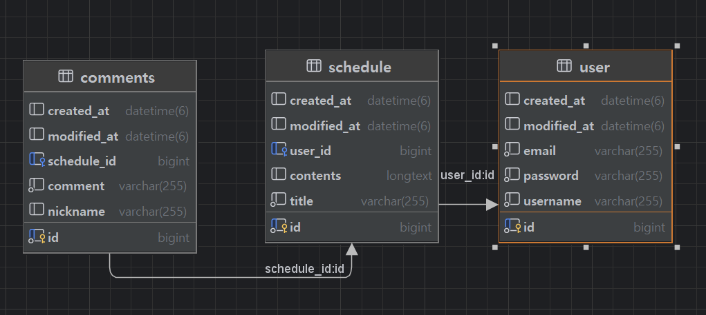

# 📱 일정관리앱 develop

## 📚목차

1. 프로젝트 소개
2. 개발 기간
3. 개발 환경
4. 초기 API명세서&ERD
5. 기능 설명&전체 API명세서&ERD
6. 어려웠던 점
7. 아쉬웠던 점

## 1️⃣ 프로젝트 소개

기존에 개발한 일정관리앱에서 JPA 기술을 적용해 기능을 더 추가한 프로젝트입니다.

## 2️⃣ 개발 기간

2025.2.6~2025.2.13 8일

## 3️⃣ 개발 환경

- IntellyJ IDEA
- JDK 17
- corretto 17.0.3
- Gradle-Groovy

### Dependency
- Spring Web
- Lombok
- Spring Data JPA
- MYSQL Driver
- H2 Database

## 4️⃣ 필수과제 API&ERD 설계

### <일정관리 앱 초기 API>

| 기능 | Method | 
|-|-|
|일정 생성 API| post |
|일정 조회 API| get |
|일정 수정 API| put |
|일정 삭제 API| delete |

### <유저관리 앱 초기 API>

| 기능 | Method |
|-|-|
| 유저 생성 | Post | 
| 유저 조회 | get| 
| 유저 수정 | put | 
| 유저 삭제 | delete |

### <초기 ERD 설계도>

## 5️⃣ 프로그램 사용법 &전체 API명세서 &ERD

1. 사용자는 회원가입을 한다. 이름, 이메일, 비밀번호를 입력한다.
2. 로그인을 한다. 가입시 작성한 이메일과 비밀번호를 입력한다.
   로그인을 하지 않으면 일정, 댓글, 유저 CRUD 기능을 사용할 수 없다.
3. 일정을 작성한다. 사용자 아이디, 제목, 내용을 입력한다.
   (단, 사용자는 사용자 고유 아이디를 입력해야 하며, 사용자 아이디는 가입된 아이디만 입력이 가능하다.)
4. 댓글을 작성한다. 일정 아이디, 이름, 내용을 입력한다.
   (단, 사용자는 일정 고유 아이디를 입력해야 하며, 현재 작성된 일정 아이디만 입력이 가능하다.)
5. 유저, 일정, 댓글 모두 생성, 조회, 삭제, 수정이 가능하다.
6. 일정 목록을 페이지로 나눠 최신 수정일 기준으로 내림차순으로 정렬해 볼 수 있다.
7. 로그아웃을 한다.
   사용자는 다시 회원가입과 로그인 기능만 사용 가능하다.

### <API 명세서&기능 설명>
https://documenter.getpostman.com/view/41411448/2sAYXCjJRd

### <ERD>

## 6️⃣ 어려웠던 점

1. JPA는 처음 접해서 새로운 개념을 익히느라 어려웠습니다.

2. 시간분배가 어려웠습니다.

3. 강의 코드를 많이 참고하였는데, 이해를 못하고 참고한 코드가 많아 에러가 많이 발생하였습니다. 결국 공부 부족으로 수정에 시간이 많이 걸렸습니다.

## 7️⃣ 아쉬웠던 점

1. 시간분배를 처음 의도대로 하지 못한 게 아쉬웠습니다.
2. 회원가입 할 때 email 중복을 막는 기능을 추가하고 싶었습니다.
3. JPA 공부가 부족한 것 같습니다.

   

# 🎊 읽어주셔서 감사합니다.

### 💻연락처
- Github: @bopeep934
- Email: gkinfn@gmail.com